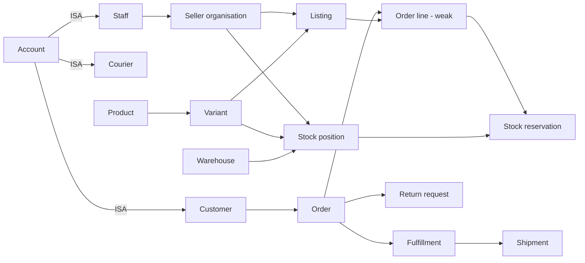

# Conceptual ER design

## Problem and boundaries

The system coordinates a marketplace with independent sellers. A customer buys listings; a listing is a seller's offer of a product variant. Warehouses may hold stock for multiple sellers. One order may contain lines from different sellers and be split across warehouses, so fulfillment and shipment are separate from the order. A delivered order can lead to a return and simulated refund.

The full model has 70 SQL tables. The table list includes strong entities, weak entities, subtype tables, and relationship tables. The number is not used as proof of the ER entity count: even after excluding relationship-only tables (`seller_staff`, `variant_values`, `cart_lines`, `wishlist_items`, `stock_positions`, `coupon_redemptions`, `gift_card_uses`, `stock_reservations`, `fulfillment_lines`, `return_lines`, and `goods_receipt_lines`), **59 named entity/subtype sets remain**. Some of those might be debated as attributes in a different ER modeling style, so review the conceptual classification with the instructor before submission.

## Main path

The focused conceptual diagram is [`er_conceptual.svg`](er_conceptual.svg); it draws the weak entity, ISA triangle, ternary diamond, and aggregation boundary. The complete zoomable relationship diagram is [`er_full.svg`](er_full.svg). It shows every table and foreign-key link. `schema.sql` is the authoritative relational implementation.

## Four required ER concepts

1. **Weak entity:** `order_lines` depends on `orders`. `line_no` is only a partial key; `(order_id, line_no)` is its full key. An order line cannot exist without its order.
2. **ISA / specialization:** `accounts` specializes into `customers`, `staff`, and `couriers`. Each subtype reuses `account_id` as both primary and foreign key. The `role` field is a discriminator. In this prototype these roles are disjoint, enforced by application convention; a future version could add triggers to enforce the role/subtype match at database level.
3. **Ternary relationship:** `stock_positions` represents **Seller × Variant × Warehouse**. Its three-column primary key means a seller can stock a variant at a warehouse once, with `available_qty` and `reorder_point` as attributes of that particular combination. Three independent binary relationships would lose which seller's variant is at which warehouse.
4. **Aggregation:** Treat the ternary stock relationship as a single higher-level object. `stock_reservations` relates an `order_line` to that exact seller–variant–warehouse stock position and records the reserved quantity. This is the relational representation of a relationship participating in another relationship. In the conceptual diagram, draw a box around the ternary `stocks` relationship, then connect `reserves` from `OrderLine` to that box.

## Cardinality decisions

- A customer can place many orders; each order belongs to exactly one customer.
- An order has one or more order lines; each line belongs to exactly one order.
- A seller can offer many listings; a listing belongs to exactly one seller and one variant.
- A variant can be stocked by many sellers at many warehouses. A stock position identifies one exact triple.
- One order line can reserve stock from multiple warehouses; each reservation refers to one order line and one stock position.
- An order can have multiple fulfillments and shipments. A return request refers to one delivered order; each return line refers to one ordered line.

## Transaction and data-integrity rules

- The database enables foreign keys on every connection. Keys, positive quantities, valid statuses, and unique natural identifiers are constrained in `schema.sql`.
- Checkout uses `BEGIN IMMEDIATE`, verifies all cart quantities, allocates positions, decreases stock positions and batches, writes stock movements, inserts order/payment/invoice rows, clears the cart, then commits. Any failure rolls everything back.
- Fulfillment and delivery each update status and insert history in a single transaction. A second attempt on an already advanced order is rejected.
- The demo holds money as integer cents to avoid floating-point rounding in SQL.
- The schema models gift cards, coupons, purchase orders, inspections, and support, but the current web interface does not execute those workflows.
